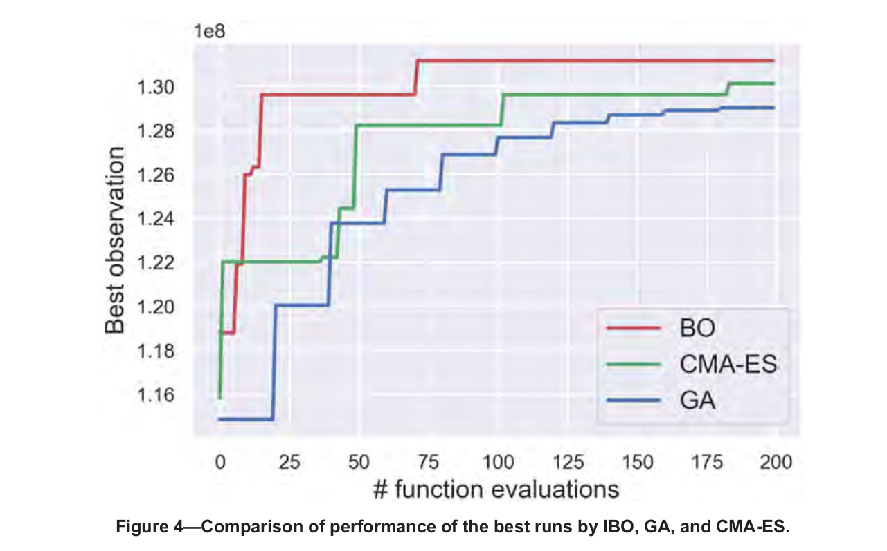
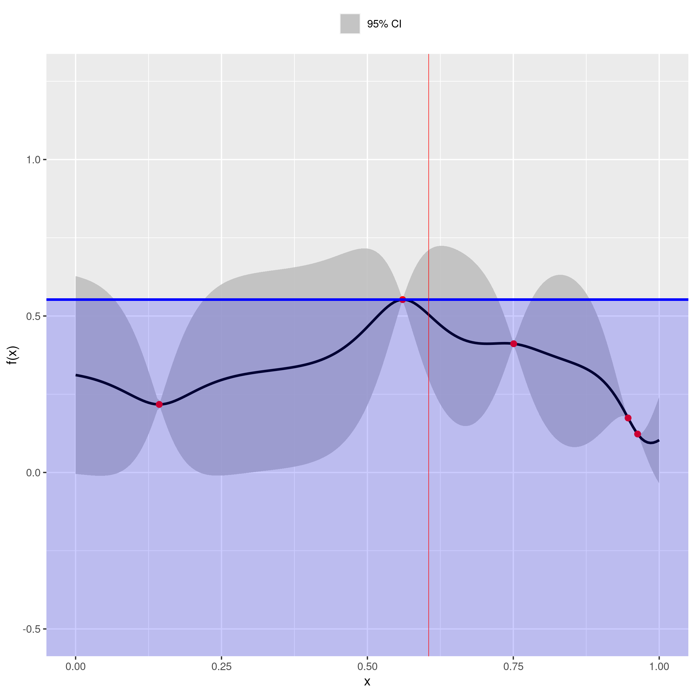
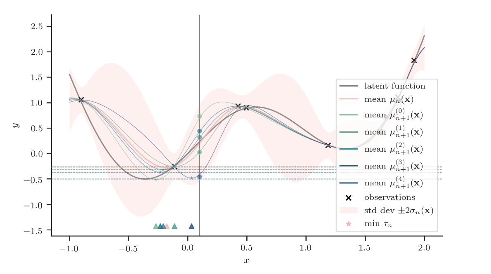

```{r setup, include=FALSE}
options(htmltools.dir.version = FALSE)
knitr::opts_chunk$set(
  fig.retina=3,
  echo = FALSE,
  message = FALSE, 
  warning = FALSE,
  hiline = TRUE
)
```

```{r xaringan-tile-view, echo=FALSE}
xaringanExtra::use_tile_view()
```

```{r xaringan-themer, include=FALSE, warning=FALSE}
library(xaringanthemer)
library(knitr)
library(xaringancolor)
library(tidyverse)
style_duo_accent(
  primary_color = "#1381B0",
  secondary_color = "#FF961C",
  inverse_header_color = "#FFFFFF"
)
```

---
name: austin-paper
class: top, top

## New Paper by: UT Austin & IBM Research 

--

.pull-left[

#### Bayesian Optimization for CO2 Storage

```{r, echo=FALSE, fig.align="center", out.height="400px"}

```

]

--

.pull-right[


#### Performance: BO > CMA-ES and GA

```{r, echo=FALSE,  out.width="80%", out.height="40%"}

```

{{content}}

]

--

#### The work is limited to: 

- **<span style="color: red;">Deterministic Optimization</span>**

---
[comment]: <> (Supported by Digires project)

name: ourpaper
class: top, top

## Manuscript by UiS/ DigiRes Supported:

--

.pull-left[

#### Bayesian Optimizatio for Well-Control 

```{r, echo=FALSE, fig.align="center"}

```

]

--

.pull-right[


#### This work: 

- **<span style="color: red;">Robust Optimization</span>**

{{content}}

]

--

#### Performance: BO > PSO and GA

```{r, echo=FALSE, out.width="100%", fig.align="center"}

```

---

name: activeresearch-deppmind
class: top, top

## Active Research Line in the Field of BO (I) - DeepMind

--

.pull-left[

#### Bayesian Optimizatio in AlphaGo

```{r, echo=FALSE, fig.align="center", out.width="100%"}

```

]

--

.pull-right[


#### Paper: BO in AlphaGo

```{r, echo=FALSE, fig.align="center",out.width="100%"}

```
]

---

name: activeresearch-fb
class: top, top

### Active Research Line in the Field of BO (I) - Facebook/Twitter

--

.pull-left[
#### Facebook: A Team Devoted to BO:

```{r, echo=FALSE, fig.align="center", out.width="60%"}

```

{{content}}

]
--

- Python Package

```{r, echo=FALSE, fig.align="center", out.width="400px", out.height= "200px"}

```

{{content}}

--

--

.pull-right[

#### Twitter: Run the Black-Box Optimization Contest


```{r, echo=FALSE, fig.align="center", out.width="60%"}

```

{{content}}

]

--

- Huawei Noah’s Ark Lab	

```{r, echo=FALSE, fig.align="center", out.width="60%", out.height="40%"}

```
{{content}}
--

---

## Rich toolset (open source) for Bayesian Optimization:

--

### More than > 10 packages actively under maintenance in Github:

```{r, echo=FALSE, fig.align="center", out.width="100%"}

```

---

name: questions 
class: middle, center

--

## For an E&P company considering the task of robust optimization:

--

### 1) What is the similarity/difference of BO to the current methods(s)?

--

### 2) Are there merits of BO to the current tool(s)?

---

name: current tool
class: top, top

## Current tool for Robust Optimization: 

--

### Focus: Ensemble-Based Optimization (EnOpt)

--

```{r, echo=FALSE, fig.align="center", out.width="100%"}

```

---

name: comparison
class: top, top

### Comparison of BO/ EnOpt

#### Two 2-d Function

--

.pull-left[

##### BOHACHEVSKY Function

- Global Optimum: $f(x^*)=0$, at $x^*= (0,0)$


```{r, echo=FALSE, fig.align="center", out.width="90%"}
library(tidyverse)
library(GA)
obj_func_boha_vis <- function(x1, x2)
{
  ##########################################################################
  #
  # BOHACHEVSKY FUNCTION 1
  #
  # Authors: Sonja Surjanovic, Simon Fraser University
  #          Derek Bingham, Simon Fraser University
  # Questions/Comments: Please email Derek Bingham at dbingham@stat.sfu.ca.
  #
  # Copyright 2013. Derek Bingham, Simon Fraser University.
  #
  # THERE IS NO WARRANTY, EXPRESS OR IMPLIED. WE DO NOT ASSUME ANY LIABILITY
  # FOR THE USE OF THIS SOFTWARE.  If software is modified to produce
  # derivative works, such modified software should be clearly marked.
  # Additionally, this program is free software; you can redistribute it 
  # and/or modify it under the terms of the GNU General Public License as 
  # published by the Free Software Foundation; version 2.0 of the License. 
  # Accordingly, this program is distributed in the hope that it will be 
  # useful, but WITHOUT ANY WARRANTY; without even the implied warranty 
  # of MERCHANTABILITY or FITNESS FOR A PARTICULAR PURPOSE. See the GNU 
  # General Public License for more details.
  #
  # For function details and reference information, see:
  # http://www.sfu.ca/~ssurjano/
  #
  ##########################################################################
  #
  # INPUT:
  #
  # xx = c(x1, x2)
  #
  ##########################################################################
  
  #x1 <- xx[1]
  #x2 <- xx[2]
  
  term1 <- x1^2
  term2 <- 2*x2^2
  term3 <- -0.3 * cos(3*pi*x1)
  term4 <- -0.4 * cos(4*pi*x2)
  
  y <- term1 + term2 + term3 + term4 + 0.7
  return(-y)
}


###################################################
x1 <- x2 <- seq(-5, 5, by = 1)
f <- outer(x1, x2, obj_func_boha_vis)

GA::persp3D(x1, x2, f, theta = 50, phi = 20, col.palette = bl2gr.colors)
```

]

--

.pull-right[


#### HIMMELBLAU'S Function 

-  multi-modal function

```{r, echo=FALSE, fig.align="center", out.width="90%"}
library(tidyverse)
###### Function and Visual #############

obj_func_himmel_vis <- function(x1,x2){
  y <- (x1^2+x2-11)^2+(x1+x2^2-7)^2
  return(-y)
}

#######################################

library(GA)

x1 <- x2 <- seq(-5, 5, by = 0.1)
f <- outer(x1, x2, obj_func_himmel_vis)

persp3D(x1, x2, f, theta = 50, phi = 20, col.palette = bl2gr.colors)
```

]

---

name: scoring Metrics
class: top, top

## Scoring Metrics

--

$$F: \text{function output} \:, t: \text{Number of Function Evaluation},\: n:\text{trial}$$
--

- $$S_{tn}= \text{cumm-max}_{t} F_{tn}$$

--

--

- $$S'_{tn}= max(S_{tn}, clip)$$
- $clip$ is the median score after a single function evaluation.
--

$$\text{mean-perf}_{t} = \text{mean}_n S'_{tn}$$
--

- Normalized mean performance:

$$\text{norm-mean-perf}_{t} = \frac{\text{Gopt}-\text{mean-perf}_{t}}{\text{Gopt}-\text{clip}}$$

--

$$\color{red}{\text{leaderboard-score}=100 \times (1-\text{norm-mean-perf}_{t})}$$
--
---
name: intro two methods
class: top, top

### What version of BO and EnOpt:

--

.pull-left[

### Classic Bayesian Optimization:

#### Probabilstic model: 

**Gaussian Process Regression.**

#### Aquistion function: 

**Expected Improvement.**

#### Optimization of aquistion function: 

**Multi-start LFBGS.**

]

--

.pull-right[

### Classic EnOpt:

#### NO Covariance Adaptaion: 

**Constant covariance matrix of the control variables.**

#### Step Length updating : 

**If objective function does not improve, reduce it by half.**

#### Stopping criteria: 

**Max iteration =20 or $\epsilon$ = 1e-3 **

]

---
name: Results
class: top, top

### Results of comparison

.pull-left[

#### BOHACHEVSKY Function

```{r, echo=FALSE}
load("processed_data/total_df_boha.rds")
```


```{r, echo=FALSE, out.width="90%", fig.retina=2}
ggplot(total_df_boha) +
  geom_line(aes(f_eval, leader_board_score, color=Opt_Method), size=2) +
  labs(x = "x", y = "PDF(x)") +
  scale_y_continuous(breaks = seq(70,100,10), limits = c(70,100)) +
  scale_x_continuous(breaks = seq(0,160,10), limits = c(0,160)) +
  geom_hline(yintercept = 90, size = 1) +
  geom_hline(yintercept = 100, size = 1, color = "red") +
  labs(x = "function evaluations", y = "Score") +
  theme(legend.position="top") +
  theme(text = element_text(size=16))
```
 

```{r, echo=FALSE, out.width="80%", include=FALSE}

```

]

--

.pull-right[

#### HIMMELBLAU'S Function 

```{r, echo=FALSE}
load("processed_data/total_df_himel.rds")
```

```{r,  echo=FALSE, out.width="90%", fig.retina=2}
ggplot(total_df_himel) +
  geom_line(aes(f_eval, leader_board_score, color=Opt_Method), size=2) +
  labs(x = "x", y = "PDF(x)") +
  #scale_y_continuous(breaks = seq(60,100,10), limits = c(60,100)) +
  scale_x_continuous(breaks = seq(0,160,10), limits = c(0,160)) +
  geom_hline(yintercept = 90, size = 1) +
  geom_hline(yintercept = 100, size = 1, color = "red") +
  labs(x = "function evaluations", y = "Score") +
  theme(legend.position="top") +
  theme(text = element_text(size=16))

```


```{r, echo=FALSE, fig.align="center", out.width="100%", include=FALSE}

```
]
---

name: dicussion 
class: middle, center

## Discussion on : How EnOpt is different from BO? 

--

### They are different in three perspective: 

--

 - #### 1) Assigning uncertainty to decision (control) alternatives,
 
 - #### 2) How to make decision for next evaluation point?
 
 - #### 3) When to stop the Optimization process

--

```{r, echo=FALSE, fig.align="center", out.width="40%"}
knitr::include_graphics("images/find_three.jpg")
```


---
name: how to look opt
class: top, top

## How to frame optimization problem?

--

### Optimization Problem: Sequential decision making problem

```{r, echo=FALSE, fig.align="center", out.width="800px", out.height= "400px"}

```

---

name: diffrences1 intro
class: center, middle

## How EnOpt is different from BO?

###  1) Assigning uncertainty to decision alternatives:

---
name: diffrences1
class: top, top

## 1) Assigning uncertainty to decision alternatives:

--

#### How Enopt works: Step 1 and 2)
.pull-left[

```{r, echo=FALSE, fig.align="center", out.width="90%"}

```

]

--

.pull-right[

```{r, echo=FALSE, out.width="90%"}

```
]

---

name: diffrences1 part2
class: top, top

###  1): Assigning uncertainty to decision alternatives:

--

.pull-left[

#### BO:

```{r, echo=FALSE, fig.align="center", out.width="90%"}

```

]

--

.pull-right[

#### EnOpt:

```{r, echo=FALSE, out.width="90%"}

```
]

---

name: summary of difference 1 
class: top, top

## Summary of 1):

### Assigning uncertainty to decision alternatives:
--

.pull-left[

### In EnOpt:

- #### We have a probability mass function to represent the distribution of alternatives.


]

--
.pull-right[

### In Bo:

- #### We have a distribution (normal) defined by mean and sd for each alternative.


]
---
name: difference 2 intro
class: center, middle

## How EnOpt is different from BO?
### 2) How to make decision for next evaluation point?

---

name: diffrences2 intro
class: top, top

## 2) How to make decision for next evaluation point?

--

.pull-left[

#### BO:

```{r, echo=FALSE, fig.align="center", out.width="90%"}

```

]

--

.pull-right[

#### EnOpt:

```{r, echo=FALSE, out.width="90%"}

```
]

---

name: summary of difference 1 and 2
class: top, top

## How to make decision for next evaluation point?

--

.pull-left[

### In EnOpt:

- #### We have a probability mass function to represent the distribution of alternatives.


- #### The Next Decision: is random from the above probability mass function.

]

--
.pull-right[

### In Bo:

- #### We have a distribution (normal) defined by mean and sd for each alternative.

- #### The Next Decision: is based on the utility of each alternative.

]


---

name: diffrences3 intro
class: center, middle

## How EnOpt is different from BO?

### 3) When to stop optimization proces?

---
name: diffrences3 part1
class: top, top

## 3) When to stop optimization process:

--

.pull-left[

### In EnOpt:

#### Criteria:

- The relative increase of the objective function is less than $10^{-3}$.

- The change to the control variables in two consecutive iterations is less than $0.1$.

]

--

.pull-right[

### In BO:

#### Criteria:
- We stop when the Value of Information (VOI) is less than the cost of acquisition of information.(Howard, 1966)

]

---
## 3) When to stop optimization process:

--

### Source of Information: Running the Numerical Reservoir Simulator

--
.pull-left[

#### Minimizng the cost: before gathering information 

```{r, echo=FALSE, out.width="150%"}

```

]

--

.pull-right[

#### Minimizng the cost: after gathering information:

```{r, echo=FALSE, out.width="150%"}

```

]
---
name:BO limit
class: top, top

## What is the limitaion of Bayesian Optimization?

--
### **<span style ="color:red;">Scaling to High Dimentional Space :</span>**

--

.pull-left[

```{r, echo=FALSE, out.width="150%"}

```

]

--

.pull-right[

```{r, echo=FALSE, out.width="150%"}

```

]


---
name: final message 
class: top, top

## Robust Optimization Landscape:

--

- **<span style ="color:red;">Past :</span>**
--

```{r, echo=FALSE, out.width="70%", fig.align='center'}

```

--

- **<span style ="color:green;">Future :</span>**

--

```{r, echo=FALSE, out.width="70%", fig.align='center'}
knitr::include_graphics("images/after_bo1.png")
```

---

name: questions 
class: middle, center

## Final Message:

--

### If you are an E&P company considering optimization of expensive to evaluate function:

--

### You (may) need to consider, research and use Bayesian Optimization,

--

### Why:

--

### 1) It has an active research line to improve it constantly.

--

### 2) It has a rich toolset (open source) to be used.

--

### 3) It is more consistent with Decision Analysis theory.
